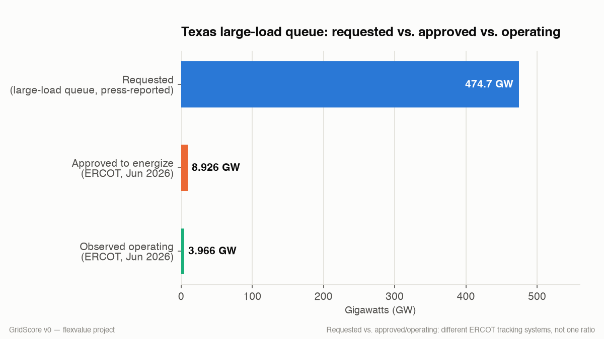
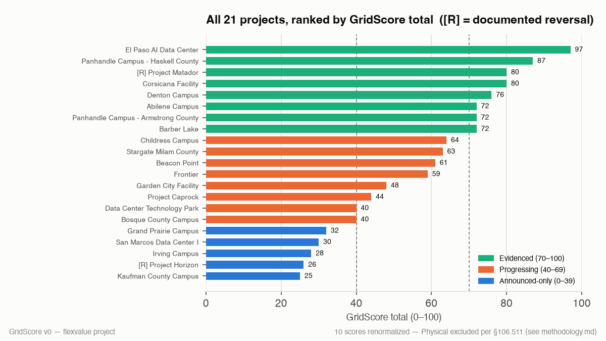
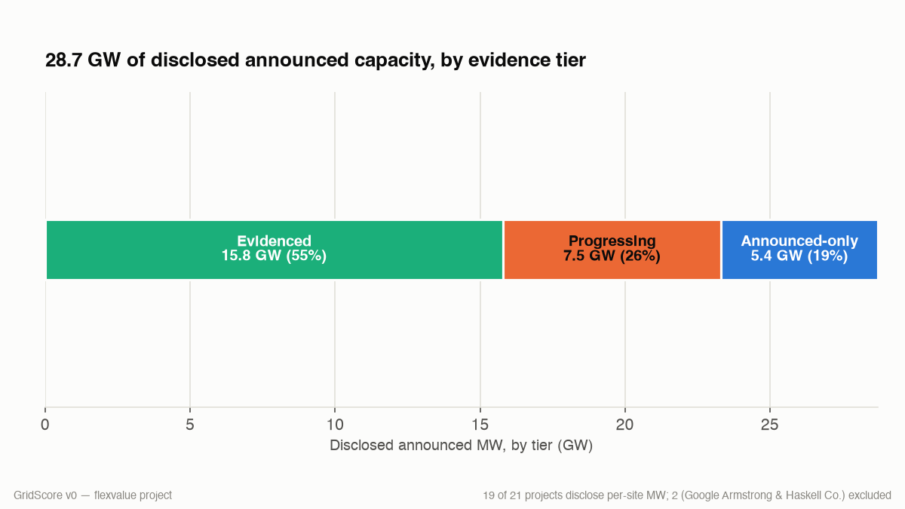

# The Texas Governor Ordered a Data Center Audit. I Already Started One by Hand

**Governor Abbott ordered ERCOT to verify every data center in its queue. I ran the same exercise from public records alone. Here is what it found, and where the record goes dark.**

---

Texas is now tracking about 474.7 GW of large-load interconnection requests. Roughly 90% of that is data centers. The grid itself peaks in the mid-80s of gigawatts, so the queue is more than five times the grid. Everyone agrees most of it will never get built. The problem is nobody can tell you which part, because there is no public way to check an announced project against ERCOT's queue. The queue is anonymous by design.

Last week I tried to close that gap the only way currently possible, which is by hand. I took the 21 largest publicly announced ERCOT-bound data center projects, about 28.7 GW of disclosed capacity, from an 11 GW Panhandle campus down to a 190 MW site, and scored each one on five public-record signals: site control (deed and government records), physical commitment (TCEQ permits for on-site generators), financial commitment (fees, agreements, financing disclosures), incentive filings (state registries and county abatements), and sponsor track record (has this developer actually energized what it announced before). Every point traces to a cited source. Where I found nothing, the score says so, and says what that does and doesn't mean.

Then, on August 3, midway through my digging, Governor Abbott directed the PUCT and ERCOT to verify and audit every data center in the interconnection process before approving more. I finished my version two days later. The state hit the same wall I did. The difference is that the state can compel disclosure. I can only read what is public. That gap is basically what this piece is about.

## What the scoring found

The tier tally: 7 projects Evidenced, 8 Progressing, 6 Announced-only. In megawatt terms, about 23% of the disclosed capacity in this universe is, at most, a name, a county, and a press release. No verifiable site control, no permits, no filings, nothing financial in any public record I could find.

The top of the table is not who you'd guess. Meta's El Paso campus leads at 97 of 100, and the strongest evidence trails in the whole universe have one thing in common: a named government counterparty. A city council, a university system, a municipal utility. Their records are public, so the deal leaves a trail. Private-to-private deals, whatever their reality, mostly don't.

The bottom isn't who you'd guess either. The single largest announcement in Texas, Fermi's 11 GW Project Matador, scores 65, the upper half of the Progressing tier, and carries a documented-reversal flag: a terminated $150M tenant funding agreement, a one-day stock drop of about 33%, and an open securities class action (Lupia v. Fermi, S.D.N.Y.). Size and evidence turn out to be completely different axes.

Now the funnel, stated carefully because these come from two different ERCOT tracking systems and shouldn't be mashed into one ratio. The request queue is near 474.7 GW. ERCOT's own June 2026 Monthly Operational Overview shows 8,926 MW of large load approved to energize, and observed peak consumption of large loads at 3,966 MW. So: under 9 GW approved, under 4 GW actually pulling power, against nearly 475 GW of requests. Whatever fraction of the queue turns out to be real, what's operating today is two orders of magnitude smaller than what's announced.

Here's one that surprised me. Zero of the 21 projects hold a JETI Act agreement, Texas's flagship incentive program. Not because they didn't apply. Data centers are excluded from JETI by statute, by industry code. The incentives that actually show up in the record are the Comptroller's data-center sales-tax registry and county abatements. Meta's 25-year El Paso abatement, which survived a repeal vote in June, is the cleanest example. One footnote so nobody catches me on it: the on-site gas plants some of these projects are building may qualify for JETI separately as generation facilities. The data centers themselves cannot.

And parts of the record are dark by design. Mid-size backup generator arrays can qualify for Texas permit-by-rule (§106.511) with no public notice at all. For those projects, a missing TCEQ docket tells you nothing. It could mean no infrastructure, or infrastructure that files no public paperwork. Scoring that absence as a zero would punish smaller projects for a visibility artifact, not for anything real. So for the nine projects in that category, the physical signal is marked "not observable" and excluded from the math entirely. Their scores rest on the four signals that can be observed, and the methodology file shows every score computed both ways. Three projects kept a true zero, each for a specific stated reason.

## What this measures, and what it doesn't

GridScore measures evidence of existence in the public record. It does not measure probability of energization. Those are different things, and Fermi is the proof: a project can be visibly troubled and still evidence-rich, because trouble generates filings. So reversals are flagged loudly, with citations, but not scored. The number stays a pure evidence measure, and the flag tells you where to look harder. If you need probability of energization, this table is an input, not an answer.

Every signal also carries a provenance tag, government-record versus press-reported-only, and the projects sitting within a few points of a tier line on press-reported evidence are flagged as exactly that: fragile. Right now that's Aligned's Project Caprock and the ECP+KKR/CyrusOne campus in Bosque County, both of which crossed a tier line under the renormalization and sit within a few points of it. I'd rather publish the uncertainty than fake the precision.

## The finding under the findings

The most important thing here isn't any single score. It's that a determined person with public records can only verify so much, and the gap between what's announced and what's checkable is the real story of the Texas data center boom. No public queue reconciliation. Permits that file no public notice. An incentive program the whole sector is statutorily invisible in. Land held through SPVs you can't trace unless a government counterparty forces the record open. The Governor's audit order exists because the state ran into the same opacity. They can subpoena their way through it. The rest of the market cannot.

That's why this is piece two of a series. Piece one priced what grid flexibility is worth, node by node (https://vishtella.substack.com/p/i-priced-grid-flexibility-at-10-texas). This one scores how much of the demand behind that flexibility is actually evidenced. Same opacity, mapped from two sides.

## The table

| Rank | Project | County | Disclosed MW | Score | Tier | Reversal |
|---|---|---|---|---|---|---|
| 1 | El Paso AI Data Center | El Paso County | 1,000 | **97** | Evidenced | — |
| 2 | Panhandle Campus - Haskell County | Haskell County | n/d | **87** | Evidenced | — |
| 3 | Corsicana Facility | Navarro County | 1,000 | **80** | Evidenced | — |
| 4 | Denton Campus | Denton County | 391 | **76** | Evidenced | — |
| 5 | Abilene Campus | Taylor County | 2,100 | **72** | Evidenced | — |
| 5 | Panhandle Campus - Armstrong County | Armstrong County | n/d | **72** | Evidenced | — |
| 5 | Barber Lake | Mitchell County | 300 | **72** | Evidenced | — |
| 8 | Project Matador | Carson County | 11,000 | **65** | Progressing | ⚠ yes |
| 9 | Childress Campus | Childress County | 1,000 | **64** | Progressing | — |
| 10 | Beacon Point | Nueces County | 1,000 | **61** | Progressing | — |
| 11 | Frontier | Shackelford County | 1,400 | **59** | Progressing | — |
| 12 | Garden City Facility | Glasscock County | 200 | **48** | Progressing | — |
| 13 | Project Caprock | Hale County | 540 | **44** | Progressing | — |
| 14 | Data Center Technology Park | Caldwell County | 2,000 | **40** | Progressing | — |
| 14 | Bosque County Campus | Bosque County | 190 | **40** | Progressing | — |
| 16 | Stargate Milam County | Milam County | 1,200 | **36** | Announced-only | — |
| 17 | Grand Prairie Campus | Ellis County | 1,800 | **32** | Announced-only | — |
| 18 | San Marcos Data Center I | Hays / Guadalupe County | 1,200 | **30** | Announced-only | — |
| 19 | Irving Campus | Dallas County | 201 | **28** | Announced-only | — |
| 20 | Project Horizon | Pecos County | 2,000 | **26** | Announced-only | ⚠ yes |
| 21 | Kaufman County Campus | Kaufman County | 200 | **25** | Announced-only | — |

*Scores for "n/o (§106.511)" projects (renormalized: Haskell/Journey, Denton, Childress, Beacon Point, Garden City, Project Caprock, Bosque County, Kaufman County, Grand Prairie) are computed over the four observable signals only — see methodology.md for the full rule and a side-by-side against the standard /100 basis.*

The full evidence appendix, every score, every citation, every "not observable" call, is in the open repo: https://github.com/tptella/gridscore.

## The ask

If you develop, finance, underwrite, or advise on any of these projects, or compete with them, tell me where the record says something different from what I read. Corrections get incorporated with credit. That's how piece one got better, and it's the whole point of publishing the evidence instead of just the scores.

And if you hold exposure to specific projects, as counterparty, comp, or credit, I'll run this same evidence workup on your list. DM me or reply to this email.

---

*Methodology, scoring rules, and the full evidence appendix: https://github.com/tptella/gridscore. Sources: county records, TCEQ, Texas Comptroller registries, PUCT and ERCOT documents, SEC filings, court records. Piece one: https://vishtella.substack.com/p/i-priced-grid-flexibility-at-10-texas. Subscribe for piece three.*
